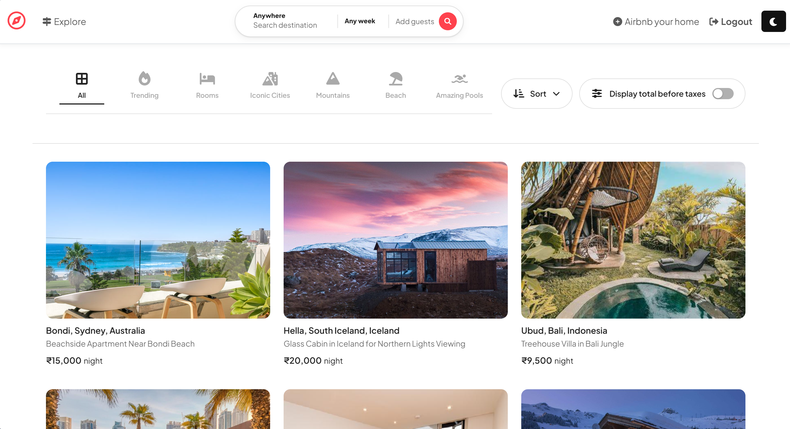
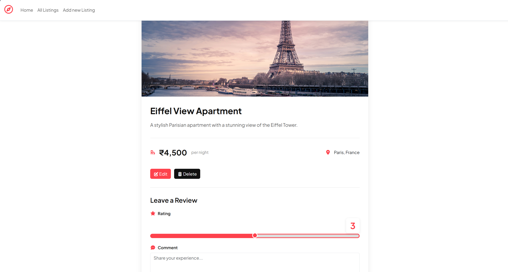
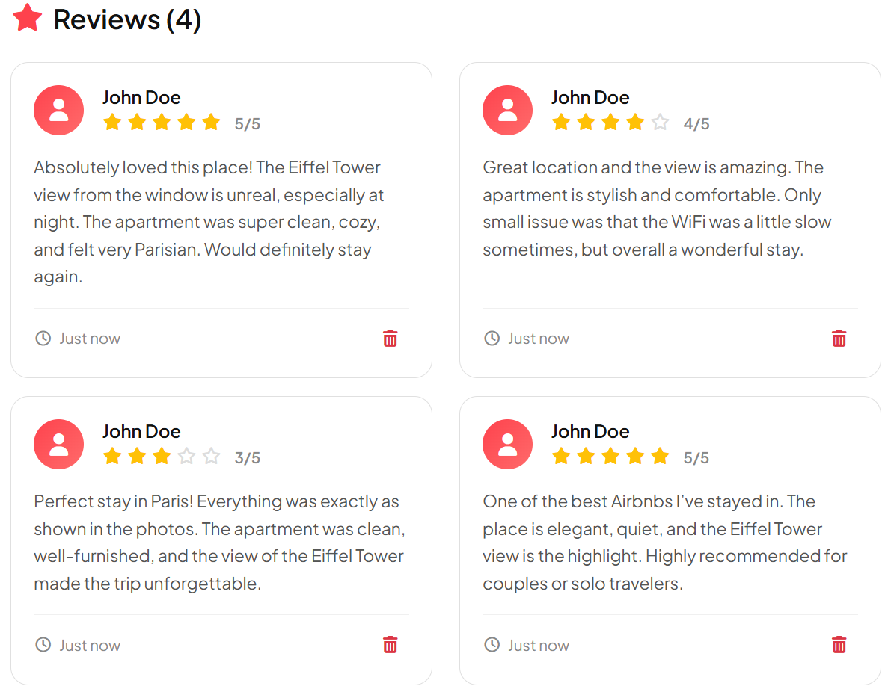

# WanderLust — Airbnb Clone 


<div align="center">



**A full-featured Airbnb-style listings web application with reviews, authentication, image uploads, and interactive maps**

[View Demo](#screenshots) · [Features](#features) · [Tech Stack](#tech-stack) · [Setup](#setup--run-locally)

</div>

---

## 🎯 Project Overview

WanderLust is a comprehensive property rental platform built with the MERN stack, featuring:

- **Phase 1:** Listings CRUD (core module)
- **Phase 2:** Reviews system with ratings, comments, and validation
- **Phase 3:** MVC architecture, authentication, image uploads (Cloudinary), and interactive maps (Mapbox)

---

## 📸 Demonstration

### Live Application Screenshots

#### Homepage & Listings

*Browse through all available properties with search functionality*

#### Property Details

*View detailed property information with interactive maps showing location*

#### Reviews & Ratings

*Star-based rating system with user reviews and comments*

---

## ✨ Features

### Phase 1: Listings CRUD
* Full CRUD operations for property listings  
* EJS templating with shared layouts (EJS-Mate)  
* Bootstrap 5 UI styling  
* Method Override support for PUT/DELETE  
* Custom error handling with `wrapAsync` and `ExpressError`  
* Static file serving  

### Phase 2: Reviews Module
* Review model with rating (1-5) + comments + timestamps  
* Add reviews to listings  
* Server-side validation using Joi  
* Client-side validation using Bootstrap  
* Delete individual reviews  
* Cascade delete: when listing deleted → all reviews deleted  
* Professional review card UI with star ratings  
* Interactive slider for rating selection  

### Phase 3: Advanced Features
 **MVC Architecture** - Clean separation of concerns (Models, Views, Controllers)  
 **Express Router** - Organized routing with `router.route()`  
 **Authentication & Authorization** - User signup, login, logout with Passport.js  
 **Password Security** - Hashing with bcrypt, salting, secure storage  
 **Session Management** - Express sessions with connect-flash for notifications  
 **Image Upload** - Cloudinary integration for image hosting  
 **Image Preview** - Preview before upload  
 **Image Editing** - Edit uploaded images  
 **Interactive Maps** - Mapbox integration with custom markers  
 **Geocoding** - Convert addresses to coordinates  
 **GeoJSON Support** - Standardized geographic data structures  
 **Star Rating System** - Using Starability library  
 **Search Functionality** - Search and filter listings  
 **Authorization Middleware** - Owner-based permissions for edit/delete  
 **Toast Notifications** - Modern Bootstrap toast alerts  

---

## 🛠️ Tech Stack

### Backend
- **Node.js** - JavaScript runtime
- **Express.js** - Web application framework
- **MongoDB** - NoSQL database
- **Mongoose** - MongoDB object modeling

### Frontend
- **EJS** - Templating engine
- **EJS-Mate** - Layout support for EJS
- **Bootstrap 5** - CSS framework
- **Starability** - Star rating library

### Authentication & Security
- **Passport.js** - Authentication middleware
- **passport-local** - Local authentication strategy
- **passport-local-mongoose** - Mongoose plugin for Passport
- **bcrypt** - Password hashing
- **express-session** - Session middleware
- **connect-flash** - Flash messages

### File Upload & Maps
- **Cloudinary** - Image upload and hosting service
- **Multer** - File upload handling
- **Mapbox GL JS** - Interactive maps
- **@mapbox/mapbox-sdk** - Mapbox geocoding service

### Validation
- **Joi** - Server-side validation
- **method-override** - HTTP method override

---

## 📁 Project Structure

```
WanderLust/
├── app.js                      # Main application file
├── cloudConfig.js              # Cloudinary configuration
├── middleware.js               # Authentication & authorization middleware
├── schema.js                   # Joi validation schemas
│
├── controllers/                # MVC Controllers
│   ├── listings.js            # Listing controller logic
│   ├── reviews.js             # Review controller logic
│   └── users.js               # User authentication controller
│
├── models/                     # MongoDB Models
│   ├── listing.js             # Listing schema & model
│   ├── review.js              # Review schema & model
│   └── user.js                # User schema & model
│
├── routes/                     # Express Routes
│   ├── listing.js             # Listing routes
│   ├── review.js              # Review routes
│   └── user.js                # User authentication routes
│
├── views/                      # EJS Templates
│   ├── layouts/
│   │   └── boilerplate.ejs    # Shared layout
│   ├── listings/
│   │   ├── index.ejs          # All listings
│   │   ├── show.ejs           # Single listing + reviews + map
│   │   ├── new.ejs            # Create listing form
│   │   └── edit.ejs           # Edit listing form
│   ├── users/
│   │   ├── signup.ejs         # User registration
│   │   └── login.ejs          # User login
│   ├── privacy.ejs            # Privacy policy
│   ├── terms.ejs              # Terms & conditions
│   └── error.ejs              # Error page
│
├── public/                     # Static Files
│   ├── css/
│   │   ├── style.css          # Custom styles
│   │   └── starability.min.css # Star rating styles
│   └── js/
│       └── map.js             # Mapbox map initialization
│
├── utils/                      # Utility Functions
│   ├── wrapAsync.js           # Async error handler
│   └── ExpressError.js        # Custom error class
│
├── init/                       # Database Initialization
│   └── index.js               # Seed database
│
├── uploads/                    # Temporary upload folder
├── Screenshots/                # Application screenshots
├── .env                        # Environment variables
├── .gitignore                 # Git ignore file
└── package.json               # Dependencies
```

---

## ✨ Data Models

### Listing Model (`models/listing.js`)

```javascript
const listingSchema = new mongoose.Schema({
  title: {
    type: String,
    required: true
  },
  description: String,
  image: {
    url: String,
    filename: String
  },
  price: Number,
  location: String,
  country: String,
  geometry: {
    type: {
      type: String,
      enum: ['Point'],
      required: true
    },
    coordinates: {
      type: [Number],
      required: true
    }
  },
  reviews: [
    {
      type: Schema.Types.ObjectId,
      ref: "Review"
    }
  ],
  owner: {
    type: Schema.Types.ObjectId,
    ref: "User"
  }
});

// Cascade delete reviews when listing is deleted
listingSchema.post("findOneAndDelete", async (listing) => {
  if (listing) {
    await Review.deleteMany({ _id: { $in: listing.reviews } });
  }
});
```

### Review Model (`models/review.js`)

```javascript
const reviewSchema = new mongoose.Schema(
  {
    rating: {
      type: Number,
      min: 1,
      max: 5,
      required: true
    },
    comment: {
      type: String,
      required: true
    },
    author: {
      type: Schema.Types.ObjectId,
      ref: "User"
    }
  },
  { timestamps: true } // Automatically adds createdAt & updatedAt
);
```

### User Model (`models/user.js`)

```javascript
const userSchema = new mongoose.Schema({
  email: {
    type: String,
    required: true
  }
});

// passport-local-mongoose automatically adds username and password fields
userSchema.plugin(passportLocalMongoose);
```

---

## 🔐 Phase 3 Deep Dive

### Part A & B: MVC Architecture & Express Router

#### MVC Pattern Benefits
- **Models**: Data and business logic (MongoDB schemas)
- **Views**: Presentation layer (EJS templates)
- **Controllers**: Application logic and request handling

#### Express Router Implementation

```javascript
// routes/listing.js
const express = require("express");
const router = express.Router();
const listingController = require("../controllers/listings");
const { isLoggedIn, isOwner, validateListing } = require("../middleware");

// Grouped routes using router.route()
router
  .route("/")
  .get(listingController.index)                          // GET all listings
  .post(isLoggedIn, validateListing, listingController.createListing); // POST new listing

router
  .route("/:id")
  .get(listingController.showListing)                    // GET single listing
  .put(isLoggedIn, isOwner, validateListing, listingController.updateListing) // UPDATE
  .delete(isLoggedIn, isOwner, listingController.destroyListing); // DELETE

router.get("/new", isLoggedIn, listingController.renderNewForm);
router.get("/:id/edit", isLoggedIn, isOwner, listingController.renderEditForm);

module.exports = router;
```

#### Controller Example

```javascript
// controllers/listings.js
module.exports.index = async (req, res) => {
  const allListings = await Listing.find({});
  res.render("listings/index", { allListings });
};

module.exports.showListing = async (req, res) => {
  let { id } = req.params;
  const listing = await Listing.findById(id)
    .populate({
      path: "reviews",
      populate: {
        path: "author"
      }
    })
    .populate("owner");
  res.render("listings/show", { listing });
};
```

### Part C: Cookies & Sessions

#### Express Session Configuration

```javascript
const session = require("express-session");
const flash = require("connect-flash");

const sessionOptions = {
  secret: process.env.SESSION_SECRET || "mysupersecretcode",
  resave: false,
  saveUninitialized: true,
  cookie: {
    expires: Date.now() + 7 * 24 * 60 * 60 * 1000, // 7 days
    maxAge: 7 * 24 * 60 * 60 * 1000,
    httpOnly: true  // Security: prevents XSS attacks
  }
};

app.use(session(sessionOptions));
app.use(flash());
```

#### Flash Messages with Toast Notifications

```javascript
// Middleware to make flash messages available in templates
app.use((req, res, next) => {
  res.locals.success = req.flash("success");
  res.locals.error = req.flash("error");
  res.locals.currUser = req.user;
  next();
});

// Usage in routes
req.flash("success", "Listing created successfully!");
res.redirect("/listings");
```

**Toast Implementation in EJS:**

```html
<!-- views/layouts/boilerplate.ejs -->
<% if (success && success.length) { %>
  <div class="toast-container position-fixed top-0 end-0 p-3" style="z-index: 9999;">
    <div class="toast align-items-center text-white border-0 show" 
         style="background-color: #28a745;">
      <div class="d-flex">
        <div class="toast-body"><%= success %></div>
        <button type="button" class="btn-close btn-close-white me-2 m-auto" 
                data-bs-dismiss="toast"></button>
      </div>
    </div>
  </div>
<% } %>

<script>
  document.addEventListener('DOMContentLoaded', function() {
    const toasts = document.querySelectorAll('.toast');
    toasts.forEach(toast => {
      setTimeout(() => {
        const bsToast = new bootstrap.Toast(toast);
        bsToast.hide();
      }, 5000);
    });
  });
</script>
```

### Part D & E: Authentication & Authorization

#### Authentication vs Authorization

| **Authentication (AuthN)** | **Authorization (AuthZ)** |
|---------------------------|--------------------------|
| "Who are you?" | "What can you do?" |
| Login with username/password | Check if user owns resource |
| Handled by Passport.js | Handled by custom middleware |
| `req.isAuthenticated()` | `isOwner`, `isReviewAuthor` |

#### Password Security

##### ❌ Never Do This:
- Store passwords as plain text
- Use reversible encryption
- Use fast hashing algorithms (MD5, SHA-256)

##### ✔ Best Practice:
- Use **bcrypt** for password hashing
- Includes automatic **salting**
- Slow by design (prevents brute-force attacks)

#### What is Salting?

**Salt** = Random data added to password before hashing

```
Without salt:
- user1: "password123" → hash: a1b2c3d4
- user2: "password123" → hash: a1b2c3d4 (same hash!)

With salt:
- user1: "password123" + salt1 → hash: x9y8z7w6
- user2: "password123" + salt2 → hash: p5q4r3s2 (different hashes!)
```

#### User Authentication Setup

```javascript
// models/user.js
const mongoose = require("mongoose");
const Schema = mongoose.Schema;
const passportLocalMongoose = require("passport-local-mongoose");

const userSchema = new Schema({
  email: {
    type: String,
    required: true
  }
});

// Adds username, hash, and salt fields automatically
userSchema.plugin(passportLocalMongoose);

module.exports = mongoose.model("User", userSchema);
```

#### Passport Configuration (`app.js`)

```javascript
const passport = require("passport");
const LocalStrategy = require("passport-local");
const User = require("./models/user");

app.use(passport.initialize());
app.use(passport.session());
passport.use(new LocalStrategy(User.authenticate()));

passport.serializeUser(User.serializeUser());
passport.deserializeUser(User.deserializeUser());
```

#### Signup Route

```javascript
// controllers/users.js
module.exports.signup = async (req, res) => {
  try {
    let { username, email, password } = req.body;
    const newUser = new User({ email, username });
    const registeredUser = await User.register(newUser, password);
    
    // Automatic login after signup
    req.login(registeredUser, (err) => {
      if (err) {
        return next(err);
      }
      req.flash("success", "Welcome to WanderLust!");
      res.redirect("/listings");
    });
  } catch (e) {
    req.flash("error", e.message);
    res.redirect("/signup");
  }
};
```

#### Login Route

```javascript
module.exports.login = async (req, res) => {
  req.flash("success", "Welcome back to WanderLust!");
  let redirectUrl = res.locals.redirectUrl || "/listings";
  res.redirect(redirectUrl);
};

// Route definition with Passport authentication
router.post(
  "/login",
  savedRedirectUrl,
  passport.authenticate("local", {
    failureRedirect: "/login",
    failureFlash: true
  }),
  userController.login
);
```

#### Logout Route

```javascript
module.exports.logout = (req, res, next) => {
  req.logout((err) => {
    if (err) {
      return next(err);
    }
    req.flash("success", "You are logged out!");
    res.redirect("/listings");
  });
};
```

### Middleware (`middleware.js`)

#### 1) `isLoggedIn` - Protect Routes Requiring Login

```javascript
module.exports.isLoggedIn = (req, res, next) => {
  if (!req.isAuthenticated()) {
    // Save redirect URL (only for GET requests)
    req.session.redirectUrl = req.originalUrl;
    req.flash("error", "You must be logged in!");
    return res.redirect("/login");
  }
  next();
};
```

#### 2) `savedRedirectUrl` - Restore Redirect After Login

```javascript
module.exports.savedRedirectUrl = (req, res, next) => {
  if (req.session.redirectUrl) {
    res.locals.redirectUrl = req.session.redirectUrl;
  }
  next();
};
```

#### 3) `isOwner` - Authorization for Listing Owner

```javascript
module.exports.isOwner = async (req, res, next) => {
  let { id } = req.params;
  let listing = await Listing.findById(id);
  
  if (!listing.owner._id.equals(res.locals.currUser._id)) {
    req.flash("error", "You don't have permission to edit this listing");
    return res.redirect(`/listings/${id}`);
  }
  next();
};
```

#### 4) `isReviewAuthor` - Authorization for Review Author

```javascript
module.exports.isReviewAuthor = async (req, res, next) => {
  let { id, reviewId } = req.params;
  let review = await Review.findById(reviewId);
  
  if (!review.author.equals(res.locals.currUser._id)) {
    req.flash("error", "You are not the author of this review");
    return res.redirect(`/listings/${id}`);
  }
  next();
};
```

#### 5) `validateListing` - Server-Side Validation

```javascript
module.exports.validateListing = (req, res, next) => {
  let { error } = listingSchema.validate(req.body);
  if (error) {
    let errMsg = error.details.map((el) => el.message).join(",");
    throw new ExpressError(400, errMsg);
  } else {
    next();
  }
};
```

#### 6) `validateReview` - Review Validation

```javascript
module.exports.validateReview = (req, res, next) => {
  let { error } = reviewSchema.validate(req.body);
  if (error) {
    let errMsg = error.details.map((el) => el.message).join(",");
    throw new ExpressError(400, errMsg);
  } else {
    next();
  }
};
```

### Image Upload with Cloudinary

#### Why Cloudinary?

**MongoDB Limitations:**
- Maximum document size: 16MB (BSON limit)
- Not optimized for binary file storage
- Performance issues with large files

**Cloudinary Benefits:**
- Handles file uploads and storage
- Automatic image optimization
- Generates unique URLs
- Built-in image transformations

#### Cloudinary Configuration (`cloudConfig.js`)

```javascript
const cloudinary = require('cloudinary').v2;
const { CloudinaryStorage } = require('multer-storage-cloudinary');

cloudinary.config({
  cloud_name: process.env.CLOUDINARY_CLOUD_NAME,
  api_key: process.env.CLOUDINARY_API_KEY,
  api_secret: process.env.CLOUDINARY_API_SECRET
});

const storage = new CloudinaryStorage({
  cloudinary: cloudinary,
  params: {
    folder: 'wanderlust_DEV',
    allowedFormats: ["png", "jpg", "jpeg"]
  }
});

module.exports = {
  cloudinary,
  storage
};
```

#### Multer Setup for File Upload

```javascript
// routes/listing.js
const multer = require('multer');
const { storage } = require("../cloudConfig");
const upload = multer({ storage });

router.post(
  "/",
  isLoggedIn,
  upload.single('listing[image]'),
  validateListing,
  listingController.createListing
);
```

#### Image Preview Before Upload

```html
<!-- views/listings/new.ejs -->
<input 
  type="file" 
  name="listing[image]" 
  class="form-control" 
  id="imageInput"
  onchange="previewImage(event)"
  accept="image/*"
>


<script>
  function previewImage(event) {
    const file = event.target.files[0];
    const preview = document.getElementById('imagePreview');
    
    if (file) {
      const reader = new FileReader();
      reader.onload = function(e) {
        preview.src = e.target.result;
        preview.style.display = 'block';
      }
      reader.readAsDataURL(file);
    }
  }
</script>
```

### Interactive Maps with Mapbox

#### Why Mapbox?

- Beautiful, customizable maps
- Built-in geocoding service
- Interactive markers and popups
- GeoJSON support
- Free tier available

#### Geocoding Setup

```javascript
// controllers/listings.js
const mbxGeocoding = require("@mapbox/mapbox-sdk/services/geocoding");
const mapToken = process.env.MAP_TOKEN;
const geocodingClient = mbxGeocoding({ accessToken: mapToken });

module.exports.createListing = async (req, res, next) => {
  // Geocode the location
  let response = await geocodingClient
    .forwardGeocode({
      query: req.body.listing.location,
      limit: 1
    })
    .send();

  let url = req.file.path;
  let filename = req.file.filename;
  
  const newListing = new Listing(req.body.listing);
  newListing.owner = req.user._id;
  newListing.image = { url, filename };
  newListing.geometry = response.body.features[0].geometry;

  await newListing.save();
  req.flash("success", "New Listing Created!");
  res.redirect("/listings");
};
```

#### GeoJSON Format

```json
{
  "type": "Point",
  "coordinates": [-122.084, 37.422]  // [longitude, latitude]
}
```

#### Mapbox Map Display

```javascript
// public/js/map.js
mapboxgl.accessToken = mapToken;

const map = new mapboxgl.Map({
  container: 'map',
  style: 'mapbox://styles/mapbox/streets-v12',
  center: listing.geometry.coordinates, // [lng, lat]
  zoom: 9
});

// Add marker
const marker = new mapboxgl.Marker({ color: "red" })
  .setLngLat(listing.geometry.coordinates)
  .setPopup(
    new mapboxgl.Popup({ offset: 25 })
      .setHTML(`<h4>${listing.title}</h4><p>${listing.location}</p>`)
  )
  .addTo(map);
```

#### Map in Show Page

```html
<!-- views/listings/show.ejs -->
<link href='https://api.mapbox.com/mapbox-gl-js/v2.14.1/mapbox-gl.css' rel='stylesheet' />
<script src='https://api.mapbox.com/mapbox-gl-js/v2.14.1/mapbox-gl.js'></script>

<div id='map' style='width: 100%; height: 400px;'></div>

<script>
  const mapToken = "<%= process.env.MAP_TOKEN %>";
  const listing = <%- JSON.stringify(listing) %>;
</script>
<script src="/js/map.js"></script>
```

### Star Rating with Starability

#### Why Starability?

- Pure CSS star ratings
- No JavaScript required for display
- Accessible (screen reader friendly)
- Customizable styles

#### Implementation

```html
<!-- Include Starability CSS -->
<link rel="stylesheet" href="/css/starability.min.css">

<!-- Rating Input -->
<fieldset class="starability-basic">
  <legend>Rating:</legend>
  <input type="radio" id="rate5" name="review[rating]" value="5" />
  <label for="rate5">5 stars</label>
  
  <input type="radio" id="rate4" name="review[rating]" value="4" />
  <label for="rate4">4 stars</label>
  
  <input type="radio" id="rate3" name="review[rating]" value="3" />
  <label for="rate3">3 stars</label>
  
  <input type="radio" id="rate2" name="review[rating]" value="2" />
  <label for="rate2">2 stars</label>
  
  <input type="radio" id="rate1" name="review[rating]" value="1" />
  <label for="rate1">1 star</label>
</fieldset>

<!-- Display Rating -->
<p class="starability-result" data-rating="<%= review.rating %>">
  Rated: <%= review.rating %> stars
</p>
```

---

## ⚙️ Setup & Run Locally

### Prerequisites

- Node.js (v14 or higher)
- MongoDB (local or Atlas)
- Cloudinary account
- Mapbox account

### Installation Steps

#### 1. Clone Repository

```bash
git clone https://github.com/yourusername/wanderlust.git
cd wanderlust
```

#### 2. Install Dependencies

```bash
npm install
```

#### 3. Create `.env` File

```env
CLOUDINARY_CLOUD_NAME=your_cloud_name
CLOUDINARY_API_KEY=your_api_key
CLOUDINARY_API_SECRET=your_api_secret
MAP_TOKEN=your_mapbox_token
ATLASDB_URL=your_mongodb_atlas_url
SECRET=your_session_secret
```

#### 4. Initialize Database (Optional)

```bash
node init/index.js
```

#### 5. Start Application

```bash
# Development mode with nodemon
npm run dev

# Production mode
npm start
```

#### 6. Open in Browser

```
http://localhost:8080/listings
```

---

## 🌐 API Routes

### Listings Routes

| Method | Route | Middleware | Description |
|--------|-------|-----------|-------------|
| GET | `/listings` | - | View all listings |
| GET | `/listings/new` | `isLoggedIn` | Show create form |
| POST | `/listings` | `isLoggedIn`, `upload`, `validateListing` | Create listing |
| GET | `/listings/:id` | - | Show single listing |
| GET | `/listings/:id/edit` | `isLoggedIn`, `isOwner` | Show edit form |
| PUT | `/listings/:id` | `isLoggedIn`, `isOwner`, `upload`, `validateListing` | Update listing |
| DELETE | `/listings/:id` | `isLoggedIn`, `isOwner` | Delete listing |

### Reviews Routes

| Method | Route | Middleware | Description |
|--------|-------|-----------|-------------|
| POST | `/listings/:id/reviews` | `isLoggedIn`, `validateReview` | Add review |
| DELETE | `/listings/:id/reviews/:reviewId` | `isLoggedIn`, `isReviewAuthor` | Delete review |

### User Routes

| Method | Route | Description |
|--------|-------|-------------|
| GET | `/signup` | Show signup form |
| POST | `/signup` | Register new user |
| GET | `/login` | Show login form |
| POST | `/login` | Authenticate user |
| GET | `/logout` | Logout user |

### Other Routes

| Method | Route | Description |
|--------|-------|-------------|
| GET | `/privacy` | Privacy policy |
| GET | `/terms` | Terms & conditions |

---

## 🔒 Security Features

* Password hashing with bcrypt  
* Salted password storage  
* HTTP-only cookies  
* CSRF protection (via express-session)  
* Input validation (client + server)  
* Authorization checks (ownership)  
* Secure session management  
* Environment variable configuration  

---

## 📝 Validation

### Server-Side (Joi)

```javascript
// schema.js
const Joi = require("joi");

module.exports.listingSchema = Joi.object({
  listing: Joi.object({
    title: Joi.string().required(),
    description: Joi.string().required(),
    location: Joi.string().required(),
    country: Joi.string().required(),
    price: Joi.number().required().min(0),
    image: Joi.string().allow("", null)
  }).required()
});

module.exports.reviewSchema = Joi.object({
  review: Joi.object({
    rating: Joi.number().required().min(1).max(5),
    comment: Joi.string().required()
  }).required()
});
```

### Client-Side (Bootstrap)

```html
<form class="needs-validation" novalidate>
  <input type="text" class="form-control" required>
  <div class="invalid-feedback">
    Please provide a valid input.
  </div>
</form>

<script>
  (function () {
    'use strict'
    const forms = document.querySelectorAll('.needs-validation')
    Array.from(forms).forEach(function (form) {
      form.addEventListener('submit', function (event) {
        if (!form.checkValidity()) {
          event.preventDefault()
          event.stopPropagation()
        }
        form.classList.add('was-validated')
      }, false)
    })
  })()
</script>
```

---

## ⚠️ Error Handling

### Custom Error Class

```javascript
// utils/ExpressError.js
class ExpressError extends Error {
  constructor(statusCode, message) {
    super();
    this.statusCode = statusCode;
    this.message = message;
  }
}

module.exports = ExpressError;
```

### Async Wrapper

```javascript
// utils/wrapAsync.js
function wrapAsync(fn) {
  return function (req, res, next) {
    fn(req, res, next).catch(next);
  };
}

module.exports = wrapAsync;
```

### Error Middleware

```javascript
// app.js
app.use((err, req, res, next) => {
  let { statusCode = 500, message = "Something went wrong!" } = err;
  res.status(statusCode).render("error", { message });
});
```

---

## 🎨 UI/UX Features

- Responsive design (mobile-friendly)
- Bootstrap 5 components
- Toast notifications for feedback
- Loading states
- Form validation feedback
- Image preview before upload
- Interactive star ratings
- Dynamic maps with markers
- Professional card layouts
- Smooth transitions

---

## 📦 Dependencies

```json
{
  "dependencies": {
    "@mapbox/mapbox-sdk": "^0.15.3",
    "cloudinary": "^1.41.0",
    "connect-flash": "^0.1.1",
    "dotenv": "^16.3.1",
    "ejs": "^3.1.9",
    "ejs-mate": "^4.0.0",
    "express": "^4.18.2",
    "express-session": "^1.17.3",
    "joi": "^17.11.0",
    "method-override": "^3.0.0",
    "mongoose": "^8.0.3",
    "multer": "^1.4.5-lts.1",
    "multer-storage-cloudinary": "^4.0.0",
    "passport": "^0.7.0",
    "passport-local": "^1.0.0",
    "passport-local-mongoose": "^8.0.0"
  },
  "devDependencies": {
    "nodemon": "^3.0.2"
  }
}
```

---

## 🔮 Future Enhancements

- [ ] Advanced search filters (price, location, amenities)
- [ ] User profiles with avatars
- [ ] Booking system
- [ ] Payment integration (Stripe)
- [ ] Email notifications
- [ ] Favorite listings
- [ ] Social media authentication (Google, Facebook)
- [ ] Real-time chat between users
- [ ] Admin dashboard
- [ ] Analytics and reporting

---

## 🤝 Contributing

This is a learning project. Contributions are welcome!

1. Fork the repository
2. Create your feature branch (`git checkout -b feature/AmazingFeature`)
3. Commit your changes (`git commit -m 'Add some AmazingFeature'`)
4. Push to the branch (`git push origin feature/AmazingFeature`)
5. Open a Pull Request

---

## 📄 License

This project is built for educational purposes and is open-source but not under the MIT License.

---

## 🙏 Acknowledgments

- **Apna College** - MERN Stack Course
- **Bootstrap** - UI Framework
- **MongoDB** - Database
- **Express.js** - Backend Framework
- **Cloudinary** - Image Hosting
- **Mapbox** - Maps & Geocoding
- **Starability** - Star Rating Library

---

## 👨‍💻 Author

**Prakash Tiwari**  
Built with ❤️ while learning Full Stack Development

- GitHub: [@Tiwari1782](https://github.com/Tiwari1782)
- Project Repository: [WanderLust](https://github.com/Tiwari1782/WanderLust)

---

## 📞 Support

For questions or support, please open an issue in the repository.

---

<div align="center">

**⭐ Star this repository if you found it helpful!**

</div>